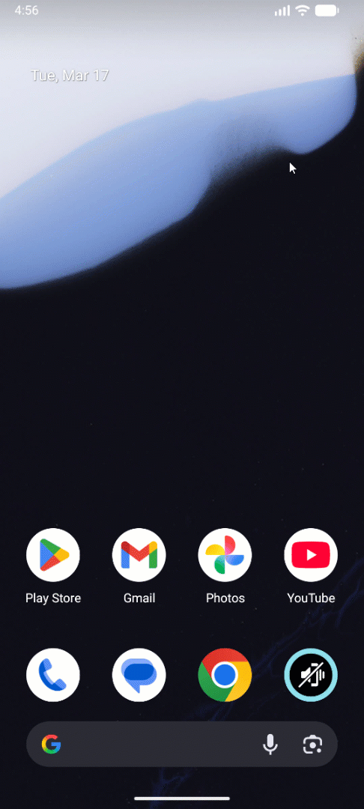

# Quick Settings Sound Profile

An app that lets you change your sound profile (ring, vibrate, mute) via a Quick Settings tile.  
The app is written 100% in Kotlin :D

## Demo video

## Features

While this app supports devices running Android 7 and above, later OS versions unlock a broader range of functionalities.

### Android 15 and Higher
On these devices, you can configure audible and visual settings individually for each **mode** in the Android system settings. This is possible because the so-called **ZenPolicy** in Android 15 offers significantly more granular control than in previous versions. While the app provides a generic ZenPolicy, you currently need to manually refine these rules in your device's system settings.

### Android 10 to 14
For devices running versions 10 through 14, the app applies a default ZenPolicy automatically whenever the phone is set to **Silent** mode. This is visible under the **Schedules** section within the **Do Not Disturb** settings.

### Android 7 to 9
On these older versions, ZenPolicy adjustments are not supported, nor do they exist, as the ZenPolicy was first introduced with Android 10. On these versions, only an **AutomaticZenRule** (which includes a ZenPolicy in newer versions) is applied. In your Do Not Disturb settings, you will see an **Automatic Rule** that activates when the device is silenced, without applying a specific policy.

## Why did I develop this app in the first place?
One of the reasons I developed the functionality to toggle the sound mode via the Quick Settings is that Google doesn't provide this option natively. On almost every other Android smartphone, you can switch the sound mode through Quick Settings, but it's simply missing on Pixel devices.

Furthermore, I wanted to explore Kotlin as a language and saw this as a great opportunity to get hands-on experience with Android development.

## Credits
For the implementation, I drew inspiration from the already existing [project](https://github.com/Alfio010/sound-quick-settings) by [Alfio010](https://github.com/Alfio010).
